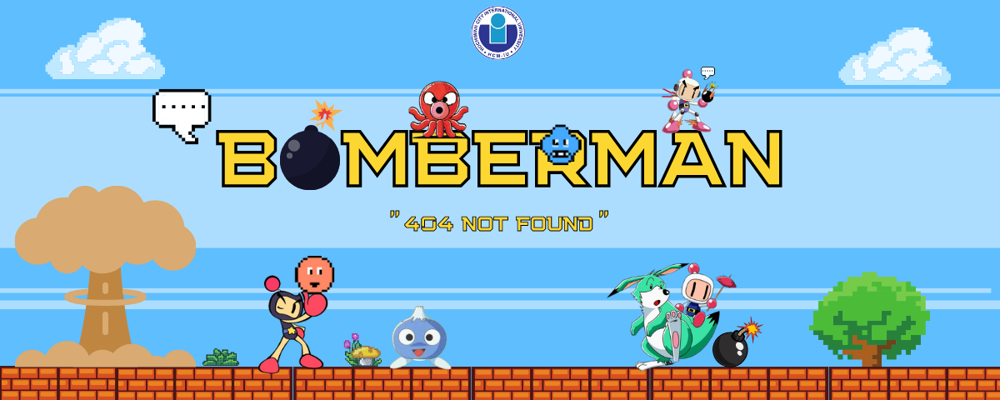

<div id="top" align="center">

</div>

[![Contributors][contributors-shield]][contributors-url]
[![Forks][forks-shield]][forks-url]
[![Stargazers][stars-shield]][stars-url]
[![Issues][issues-shield]][issues-url]

<!-- PROJECT LOGO -->
<br />
<div align="center">
  <a href="https://github.com/Nhathuy1305/OOP_BOMBERMAN_GAME.git">
    
  </a>

  <h3 align="center">OOP BOMBERMAN PROJECT</h3>
  <h4 align="center">Team Name: 404 NOT FOUND</h4>

  <p align="center">
    A Java game created with JavaFX for OOP course in International University - VNUHCM!
    <br />
    <br />
    <a href="https://youtu.be/iLo5E-07aY0">View Demo</a>
  </p>
</div>

<!-- TABLE OF CONTENTS -->
# Table of contents :round_pushpin:
1. [Introduction](#Introduction)
2. [Game](#Game)
3. [UML-class-diagram](#UML-class-diagram)
4. [Features](#Features)
5. [Challenges](#Challenges)
6. [Acknowledgments](#Acknowledgments)
7. [References](#References)
<!-- <details>
  <summary>Table of Contents</summary>
  <ol>
    <li>
      <a href="#Introduction">Introduction</a>
      <ul>
        <li><a href="#Team-members">Team Members</a></li>
	<li><a href="#installation">Installation</a></li>
	<li><a href="#motivation">Motivation</a></li>
	<li><a href="#task-allocation">Task Allocation</a></li>      
      </ul>
    </li>
    <li><a href="#technologies">Technologies</a></li>
    <li><a href="#uml-class-diagram">UML Class Diagram</a></li>
    <li><a href="#features">Features</a></li>
    <li><a href="#challenges">Challenges</a></li>
    <li><a href="#acknowledgments">Acknowledgments</a></li>
    <li><a href="#references">References</a></li>
  </ol>
</details> -->

<!-- ABOUT THE PROJECT -->

## Introduction <a name="Introduction"></a> :bricks:

<div align="center">

</div>

<div style="text-align:justify">
This is our game project for our final lab in our Object-Oriented Programming course in semester 2 (2020 - 2021). Bomberman is an individual game that does not require players have excellent skills or advanced technology. It's a straightforward game that may be enjoyed by people of all ages. As a result of all of these factors, we developed a program that is user-friendly and assists users in having the greatest possible experiences. So, what are we waiting for? Let the story begin!
</div>

### Team Members :couplekiss_man_man:

| Order |         Name          |     ID      |            Email            |                       Github account                        |
| :---: | :-------------------: | :---------: | :-------------------------: | :---------------------------------------------------------: |
|   1   |     Dang Nhat Huy     | ITITIU20043 |    dnhuy.ityu@gmail.com     |        [Nhathuy1305](https://github.com/Nhathuy1305)        |
|   2   |     Pham Gia Bao      | ITITIU20166 | Phamgiabao1862001@gmail.com |           [giabao18](https://github.com/giabao18)           |
|   3   | Phan Nguyen Hoang Bao | ITITIU20165 | hoangbao15082002@gmail.com  | [Mr@JEY](https://github.com/PhanNguyenHoangBao-ITITIU20165) |
|   4   | Nguyen Luan Cong Bang | ITITIU20163 | bangnguyen.071102@gmail.com |       [congbangitiu](https://github.com/congbangitiu)       |

### Installation :dart: 

1. Open the terminal on your IDE
2. Clone the repo
   ```sh
   git clone https://github.com/Nhathuy1305/OOP_BOMBERMAN_GAME
   ```
3. Check the file status
   ```sh
   git status
   ```
4. Change branch
   ```js
   git checkout 'branch_name'
   ```

### Motivation :mechanical_arm:

<div style="text-align:justify">
As a fresher developer, we assume that the Bomberman game is one of the most simple game which helps us in practicing coding with OOP also some significant aspects of the front-end such as: How to render the game? , How frame working in UX/UI? , ….
</div>

### Task Allocation :ok_man:

| Order | Task                                    |  Person   | Contribution |
| :---- | :-------------------------------------- | :-------: | :----------: |
| 1     | Graphics, Bot , Github Management | Nhat Huy  |      25      |
| 2     | Level, Utility                 |  Gia Bao  |      25      |
| 3     | Control, Ui                             | Hoang Bao |      25      |
| 4     | Entities, PowerPoint                    | Cong Bang |      25      |


<!-- Game -->
<br />

## Game <a name="Game"></a>:joystick:
### Technologies :globe_with_meridians:

- Language: [JAVA](https://www.java.com/en/)
- Framework: [IntelliJ](https://www.jetbrains.com/idea/), [Visual Studio Code](https://code.visualstudio.com)
- Intelligent: [A\* algorithms](https://www.geeksforgeeks.org/a-search-algorithm/)
- Library: [JavaFx](https://openjfx.io)


### How to play ? :video_game:
<div style="text-align:justify">

Players will direct the character's movement in order to place bombs to killing the enemy. After the player has killed all of the monsters of this level a portal will open for the character to enter in order to advance to the next level (we have 3 levels).
</div>

### Game logic :bulb:

- Character: The character is controlled by the arrow key combination, only one bomb can be placed at a time.Moreover ,The character will gain speed change if the value is SpeedItem.
<div align="center">

</div>


<br />


- Bomb : When the bomb explodes, it will create a fire trail, if the character or the enemy hits the fire trail, they will all be destroyed. The length of the flame will increase if the character eats flameitem
<div align="center">

</div>


<br />

- Enemy: includes 4 types and is divided by level, each type has its own attribute.
<div align="center">


</div>


<br />

- Brick : it Can be broken by bombs and can contain items

<br />

- Wall : it cannot be broken to limit the movement of characters and enemies

<br />

## UML Class Diagram<a name="UML-class-diagram"></a>:clipboard:
<!--  -->

<div>
	<h3>1. CONTROL</h3>
    <div align="center">
        
    </div>
    <br />
	<div align="center">------------------------------------</div>
    <br />
	<h3>2. ENTITY</h3>
    <h4>a) Animal</h4>
    <div align="center">
        
    </div>
    <h4>b) Intelligent with "Doll" enemy</h4>
    <div align="center">
        
    </div>
    <h4>c) Block</h4>
    <div align="center">
        
    </div>
    <h4>d) Items</h4>
    <div align="center">
        
    </div>
    <h4>e) Items with Entity</h4>
    <div align="center">
        
    </div>
    <h4>f) Animal with Entity</h4>
    <div align="center">
        
    </div>
	<div align="center">------------------------------------</div>
	<h3>3. FEATURES</h3>
    <div align="center">
        
    </div>
    <br />
	<div align="center">------------------------------------</div>
	<h3>4. GAMERUNNER</h3>
    <div align="center">
        
    </div>
    <br />
	<div align="center">------------------------------------</div>
	<h3>5. GRAPHICS</h3>
    <div align="center">
        
    </div>
    <br />
	<div align="center">------------------------------------</div>
	<h3>6. LEVELS</h3>
    <div align="center">
        
    </div>
    <br />
    <div align="center">------------------------------------</div>
</div>

<br />

<!-- FEATURES -->
## Features<a name="Features"> :triangular_flag_on_post:
- Completed: UX/UI, sound of game, enhancing algorithms
- Incompleted: Minvo, 2 players, multiple characters for choosing, …
<br />

<!-- CHALLENGES -->
## Challenges<a name="Challenges">:bangbang:

- Task allocation for each team member
- Using platform for communication ([Trello](https://trello.com/b/Ac0ISkzt/bomber-game-oop-project-2022))
- Working environment (Github)
<br />
	
## Acknowledgments<a name="Acknowledgments">:brain:
<div style="text-align:justify">
We would want to express our gratitude to Tom for providing us with the chance to
participate in this project and apply what we learned in theory into practice. This project's
learning curve was steep, but it was well worth it for all of us. We have learned more about interface technologies to construct a functioning application
that interacts with our project. Tom, we want to thank you again for all the hard work and expertise that you have
put into your teaching. We'll make sure that all we've learned doesn't go to waste, and that
we can master them better from now on :heart:
</div>

<br />


## References<a name="References">  :eye::tongue::eye:
1. [phuctd99](https://github.com/phuctd99/bom)
2. [carlosflorencio](https://github.com/carlosflorencio/bomberman/blob/master/.project)
3. [minhnq410](https://github.com/minhnq410/Bomberman_Assignment_2/tree/master/src/uet/oop/bomberman)
4. [JavaFx Tutorial](https://openjfx.io/openjfx-docs/)
5. [A* Intelligent](https://www.simplilearn.com/tutorials/artificial-intelligence-tutorial/a-star-algorithm#:~:text=PythonExplore%20Course-,What%20is%20an%20A*%20Algorithm%3F,shortest%20path%20to%20be%20taken.)

<br />

<p align="right">(<a href="#top">Back to top</a>)</p>

<!-- MARKDOWN LINKS & IMAGES -->
<!-- https://www.markdownguide.org/basic-syntax/#reference-style-links -->

[contributors-shield]: https://img.shields.io/github/contributors/Nhathuy1305/OOP_BOMBERMAN_GAME.svg?style=for-the-badge
[contributors-url]: https://github.com/Nhathuy1305/OOP_BOMBERMAN_GAME/graphs/contributors
[forks-shield]: https://img.shields.io/github/forks/Nhathuy1305/OOP_BOMBERMAN_GAME.svg?style=for-the-badge
[forks-url]: https://github.com/Nhathuy1305/OOP_BOMBERMAN_GAME/network/members
[stars-shield]: https://img.shields.io/github/stars/Nhathuy1305/OOP_BOMBERMAN_GAME.svg?style=for-the-badge
[stars-url]: https://github.com/Nhathuy1305/OOP_BOMBERMAN_GAME/stargazers
[issues-shield]: https://img.shields.io/github/issues/Nhathuy1305/OOP_BOMBERMAN_GAME.svg?style=for-the-badge
[issues-url]: https://github.com//Nhathuy1305/OOP_BOMBERMAN_GAME/issues
