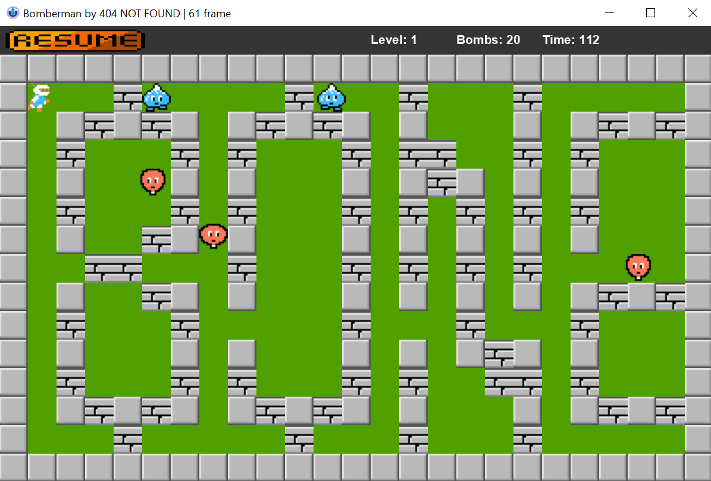

<div id="top"></div>

[![Contributors][contributors-shield]][contributors-url]
[![Forks][forks-shield]][forks-url]
[![Stargazers][stars-shield]][stars-url]
[![Issues][issues-shield]][issues-url]


<!-- PROJECT LOGO -->
<br />
<div align="center">
  <a href="https://github.com/Nhathuy1305/OOP_BOMBERMAN_GAME.git">
    
  </a>

  <h3 align="center">OOP BOMBERMAN PROJECT</h3>
  <h4 align="center">Team Name: 404 NOT FOUND</h4>	

  <p align="center">
    A Java game created with JavaFX for OOP course in International University - VNUHCM!
    <br />
    <br />
    <a href="https://github.com/Nhathuy1305/OOP_BOMBERMAN_GAME.git">View Demo</a>
  </p>
</div>


<!-- TABLE OF CONTENTS -->
<details>
  <summary>Table of Contents</summary>
  <ol>
    <li>
      <a href="#introduction">Introduction</a>
      <ul>
        <li><a href="#team-members">Team Members</a></li>
	<li><a href="#installation">Installation</a></li>
	<li><a href="#motivation">Motivation</a></li>
	<li><a href="#task-allocation">Task Allocation</a></li>      
      </ul>
    </li>
    <li><a href="#technologies">Technologies</a></li>
    <li><a href="#uml-class-diagram">UML Class Diagram</a></li>
    <li><a href="#features">Features</a></li>
    <li><a href="#challenges">Challenges</a></li>
    <li><a href="#acknowledgments">Acknowledgments</a></li>
    <li><a href="#contact">Contact</a></li>
    <li><a href="#references">References</a></li>
  </ol>
</details>


<!-- ABOUT THE PROJECT -->
## Introduction



This is our game project for our final lab in our Object-Oriented Programming course in semester 2 (2020 - 2021). Bomberman is an individual game that does not require players have excellent skills or advanced technology. It's a straightforward game that may be enjoyed by people of all ages. As a result of all of these factors, we developed a program that is user-friendly and assists users in having the greatest possible experiences. So, what are we waiting for? Let the story begin!

### Team Members
```
- Phạm Gia Bảo – ITITIU20166 (leader)
- Phan Nguyễn Hoàng Bảo – ITITIU20165
- Nguyễn Luận Công Bằng - ITITIU20163
- Đặng Nhật Huy - ITITIU20043
```

### Installation

1. Open the terminal on your IDE
2. Clone the repo
   ```sh
   git clone https://github.com/Nhathuy1305/OOP_BOMBERMAN_GAME
   ```
3. Check the file status
   ```sh
   git status
   ```
4. Change branch 
   ```js
   git checkout 'branch_name'
   ```

### Motivation

As a fresher developer, we assume that the Bomberman game is one the most simple game which helps us in practicing coding with OOP also some significant aspects of the front-end such as: How to render the game? , How frame working in UX/UI? , ….

### Task Allocation

|Order| Task      | Person |Contribution|
|:---|   :-------------------------------------------------------| :--------: |:-----:|
| 1  | Level, Utility, Readme.md      | Gia Bao      |25|
| 2  | Control| Hoang Bao    |25|
|3| Entities | Cong Bang|   25  |
|4| Graphics | Nhat Huy     |  25  |  

<br />

## Technologies
- Language:  [JAVA](https://www.java.com/en/)
- Framework:  [IntelliJ](https://www.jetbrains.com/idea/), [Visual Studio Code](https://code.visualstudio.com)
- Intelligent:  [A* algorithms](https://www.geeksforgeeks.org/a-search-algorithm/)
- Library:  [JavaFx](https://openjfx.io)

<br />

## UML Class Diagram

<br />

## Features

<br />

<!-- CHALLENGES -->
## Challenges
- Task allocation for each team member
- Using platform for communication (Trello)  
- Working environment (Github)

<br />
	
## Acknowledgments

<br />

<!-- CONTACT -->
## Contact

|Order    | Name      | ID  |              Email               | Github account       |    Facebook            | 
| :------------: |   :---:       | :--------: |:--------------------------------:|:---------------------------:| :----------------:|
|1| Pham Gia Bao           | ITITIU20166  |  Phamgiabao1862001@gmail.com     |   [giabao18](https://github.com/giabao18)                      |  [Gia Bảo](https://www.facebook.com/profile.php?id=100007374601572) |
|2| Phan Nguyen Hoang Bao  | ITITIU20165  | hoangbao15082002@gmail.com       | [Mr@JEY](https://github.com/PhanNguyenHoangBao-ITITIU20165)                           |  [Hoàng Bảo](https://www.facebook.com/kuma.jeyruei)|
|3| Nguyen Luan Cong Bang  | ITITIU20163  | bangnguyen.071102@gmail.com      |   [congbangitiu](https://github.com/congbangitiu)                  | [Công Bằng](https://www.facebook.com/congbang.nguyenluan)|
|4| Dang Nhat Huy          | ITITIU20043  | dnhuy.ityu@gmail.com             |    [Nhathuy1305](https://github.com/Nhathuy1305)                        | [Nhật Huy](https://www.facebook.com/nhhuy.135/)|

<br />

## References


<p align="right">(<a href="#top">Back to top</a>)</p>


<!-- MARKDOWN LINKS & IMAGES -->
<!-- https://www.markdownguide.org/basic-syntax/#reference-style-links -->
[contributors-shield]: https://img.shields.io/github/contributors/Nhathuy1305/OOP_BOMBERMAN_GAME.svg?style=for-the-badge
[contributors-url]: https://github.com/Nhathuy1305/OOP_BOMBERMAN_GAME/graphs/contributors
[forks-shield]: https://img.shields.io/github/forks/Nhathuy1305/OOP_BOMBERMAN_GAME.svg?style=for-the-badge
[forks-url]: https://github.com/Nhathuy1305/OOP_BOMBERMAN_GAME/network/members
[stars-shield]: https://img.shields.io/github/stars/Nhathuy1305/OOP_BOMBERMAN_GAME.svg?style=for-the-badge
[stars-url]: https://github.com/Nhathuy1305/OOP_BOMBERMAN_GAME/stargazers
[issues-shield]: https://img.shields.io/github/issues/Nhathuy1305/OOP_BOMBERMAN_GAME.svg?style=for-the-badge
[issues-url]: https://github.com//Nhathuy1305/OOP_BOMBERMAN_GAME/issues
[product-screenshot]: images/screenshot.png
